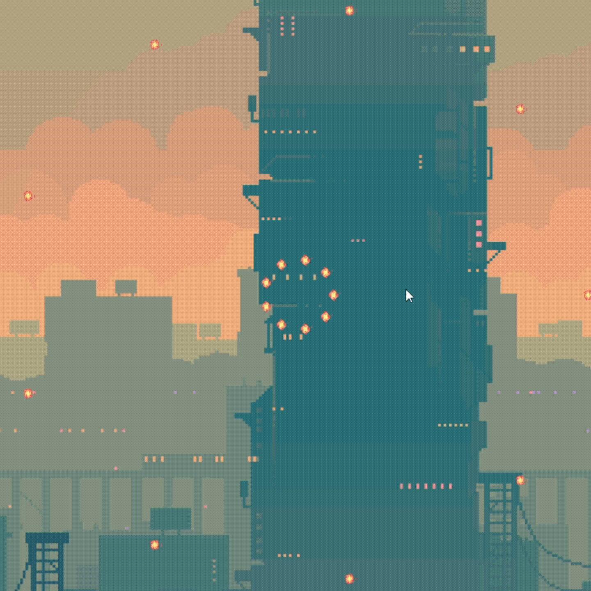
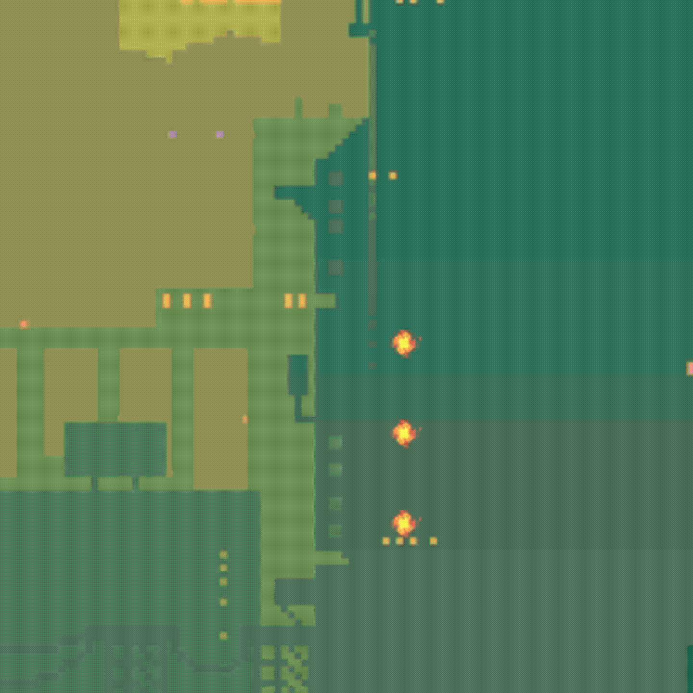
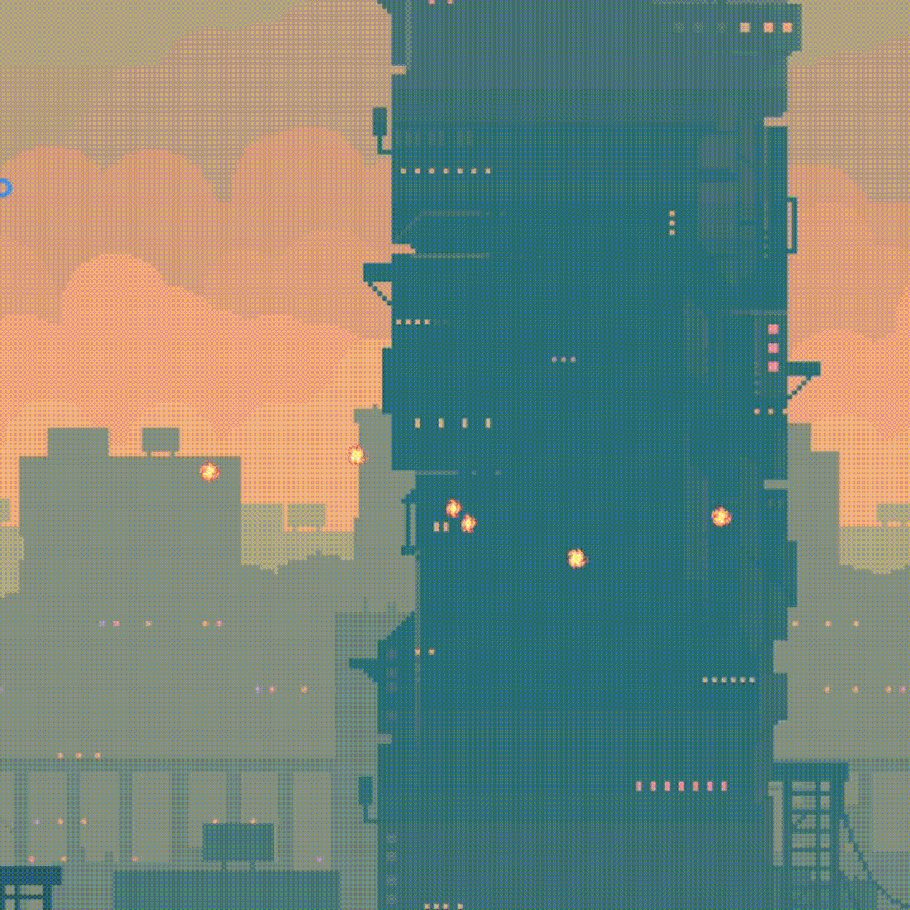
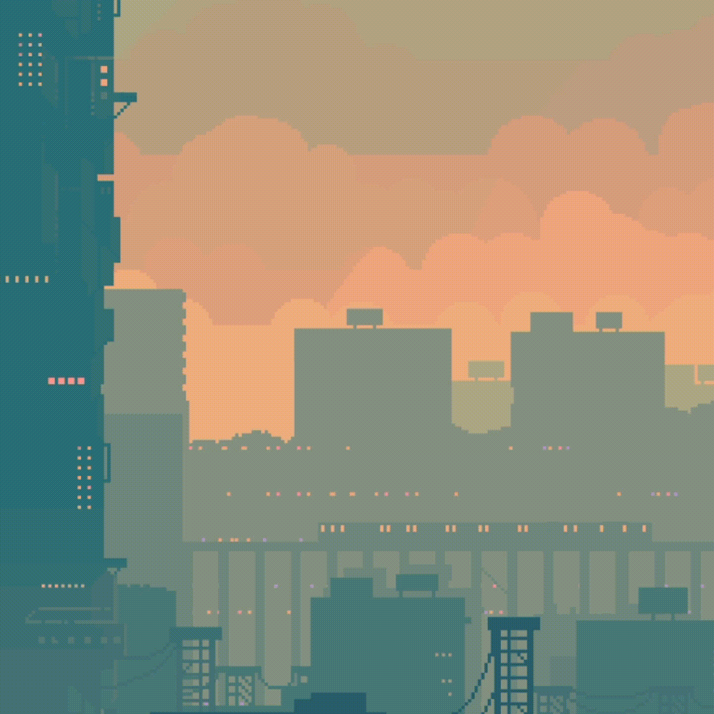
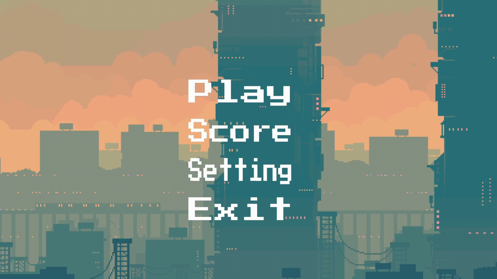

# Bullet Barrage (Minigame)

- **Giới thiệu game:** https://youtu.be/-rurGAphFeQ?si=AvBmSESGc3_YIoqR
- **Trải nghiệm game:** https://youtu.be/-xDHRhAl69U?si=EBzf9lO-LOrxxUrS

## Thông tin

- **Full Name:** Nguyễn Duy Hưng
- **Student ID:** 22028264
- **Course:** 2324H_INT2215_70

## Giới thiệu game

**Bullet Barrage** là một minigame, nơi người chơi phải né tránh các làn đạn được bắn ra từ mọi hướng. Mục tiêu của trò chơi là sống sót lâu nhất có thể bằng cách di chuyển để tránh bị trúng đạn.

### Mục lục

- [Cách để chơi](#cách-để-chơi)
    * [1. Bắt đầu chơi](#1-bắt-đầu-chơi)
    * [2. Điều khiển nhân vật](#2-điều-khiển-nhân-vật)
    * [3. Kết thúc trò chơi](#3-kết-thúc-trò-chơi)
    * [4. Mẹo hữu ích](#4-mẹo-hữu-ích)
    * [5. Những loại đạn](#5-những-loại-đạn)
- [Bắt đầu game](#bắt-đầu-game)
- [Các thành phần trong game](#các-thành-phần-trong-game)
- [Cấu trúc game](#cấu-trúc-game)
    * [Main Components](#main-components)
    * [Menu Management](#menu-management)
    * [Player Control](#player-control)
    * [Background Management](#background-management)
    * [Collision Detection](#collision-detection)
    * [Threat Management](#threat-management)
    * [Score Management](#score-management)
    * [Setting Management](#setting-management)
    * [Play Screen Management](#play-screen-management)
    * [Score Screen Management](#score-screen-management)
- [Kỹ thuật, công nghệ sử dụng](#kỹ-thuật-công-nghệ-sử-dụng)
- [Nguồn tham khảo](#nguồn-tham-khảo)
- [Cách tải game](#cách-tải-game)
- [Kết luận](#kết-luận)
    * [Ưu điểm](#ưu-điểm)
    * [Hạn chế](#hạn-chế)
    * [Bài học kinh nghiệm](#bài-học-kinh-nghiệm)
    * [Nguyện vọng về điểm](#nguyện-vọng-về-điểm)

## Cách để chơi

### 1. Bắt đầu chơi
Trò chơi bắt đầu khi các viên đạn được bắn ra từ các cạnh của đấu trường. Người chơi sử dụng các phím điều khiển để di chuyển nhân vật và né tránh đạn.
Lưu ý : Tốc độ của các viên đạn tăng dần theo thời gian trôi qua.

### 2. Điều khiển nhân vật
Sử dụng các phím mũi tên để di chuyển nhân vật lên, trái hoặc phải. Đặc biệt nhân vật có khả năng double jump khi nhảy lần 2 ở trên không trung.

### 3. Kết thúc trò chơi
Trò chơi kết thúc khi người chơi hết 3 máu.

### 4. Mẹo hữu ích
Duy trì sự di chuyển liên tục và tìm kiếm các khoảng trống giữa các làn đạn để có thể sống sót lâu nhất.

### 5. Những loại đạn

<table>
  <tr>
    <td></td>
    <td>Đạn vòng tròn</td>
    <td>Những viên đạn toả ra theo hình tròn.</td>
  </tr>
  <tr>
    <td></td>
    <td>Đạn đơn</td>
    <td>Ba viên bắn theo phương ngang với tốc độ cực nhanh từ phía bất kì.</td>
  </tr>
  <tr>
    <td></td>
    <td>Đạn xoắn</td>
    <td>Những viên đạn toả ra theo kiểu xoắn ốc.</td>
  </tr>
  <tr>
    <td></td>
    <td>Đạn toả</td>
    <td>Những viên đạn toả ra theo hình nón.</td>
  </tr>
</table>

## Bắt đầu game

Khi bắt đầu, chúng ta sẽ xuất phát với màn hình Menu. 

Khi chọn Setting, chúng ta được điều chỉnh âm lượng và thay đổi nhạc nền. 

Khi chọn Score, chúng ta được xem top 10 điểm số cao nhất mà người chơi từng đạt được.

Khi chọn Play, chúng ta sẽ đến với màn chơi chính. Nơi nhân vật phải né toàn bộ những viên đạn bắn ra từ mọi phía để có thể sống sót.

Ta có thể tạm dừng trò chơi trong nút setting ở trên cùng bên phải màn hình.

Ở đây chúng ta sẽ đọc được nội dung trò chơi cùng với tắt bật âm thanh hoặc quay lại màn hình chính và tiếp tục trò chơi.

## Các thành phần trong game

- Nhân vật chính  : Nhân vật chính của game.
- Pause   : Bấm để tạm dừng và thực hiện các điều chỉnh thông số.   
- Home  : Bấm để trở về màn hình chính.
- Resume  : Bấm để tiếp tục chơi khi đang pause.
- Replay : Bấm để chơi lại sau khi đã thua.
- Bật/tắt âm thanh  
- Máu của nhân vật  : Lượng máu nhân vật còn lại.
- Viên đạn  : Viên đạn mà nhân vật cần né tránh.

## Cấu trúc game

Cấu trúc của trò chơi **Bullet Barrage** được tổ chức như sau:

### Main Components
- **`main.cpp & main.h`**: Tệp chính quản lý vòng lặp sự kiện, xử lý các màn hình khác nhau (MENU, GAME, SCORE, SETTING), và điều khiển hiển thị.

### Menu Management
- **`Menu.cpp & Menu.h`**: Quản lý giao diện menu, xử lý sự kiện và hiển thị các nút menu. Bao gồm các nút như "Play", "Score", "Setting", và "Exit".

### Player Control
- **`Player.cpp & Player.h`**: Định nghĩa hành vi của nhân vật chính, bao gồm di chuyển, nhảy, và xử lý sự kiện bàn phím. Quản lý các hiệu ứng âm thanh và trạng thái sức khỏe của nhân vật.

### Background Management
- **`Background.cpp & Background.h`**: Quản lý hình nền động, bao gồm việc tải và cập nhật các khung hình nền.

### Collision Detection
- **`Collision.cpp & Collision.h`**: Cung cấp chức năng kiểm tra va chạm giữa các đối tượng bằng cách xác định xem hai vật thể có giao nhau hay không.

### Threat Management
- **`Threat.cpp & Threat.h`**: Định nghĩa các mối đe dọa trong trò chơi như đạn và bom, bao gồm việc cập nhật và hiển thị chúng trên màn hình. Quản lý vị trí và vận tốc của các đối tượng này.

### Score Management
- **`Score.cpp & Score.h`**: Quản lý điểm số của người chơi, lưu trữ và tải điểm số từ tệp tin. Hiển thị bảng điểm cao trong trò chơi.

### Setting Management
- **`Setting.cpp & Setting.h`**: Quản lý các thiết lập của trò chơi như âm thanh, nhạc nền. Bao gồm các chức năng điều chỉnh âm lượng và thay đổi nhạc nền.

### Play Screen Management
- **`PlayScreen.cpp & PlayScreen.h`**: Quản lý màn hình chơi chính, bao gồm việc xử lý các sự kiện trong trò chơi, cập nhật và hiển thị các yếu tố trò chơi như nhân vật chính, mối đe dọa và điểm số. Quản lý các mẫu đạn bắn ra và xử lý va chạm.

### Score Screen Management
- **`ScoreScreen.cpp & ScoreScreen.h`**: Hiển thị bảng điểm cao và xử lý các sự kiện liên quan đến màn hình điểm số. Cho phép người chơi quay lại menu chính từ màn hình này.

## Kỹ thuật, công nghệ sử dụng

- Sử dụng các hàm trong thư viện SDL bao gồm: xử lý đồ họa, font chữ, âm thanh, thao tác chuột, bàn phím, …
- Sử dụng class để có thể đóng gói các đối tượng, phương thức giúp đọc hiểu và tái sử dụng code dễ dàng hơn.
- Kết hợp thư viện SDL với làm việc với file để load và xử lý ảnh, font chữ và âm thanh.
- Sử dụng Vector để lưu trữ viên đạn và các thuật toán sắp xếp cùng kiểm tra va chạm và xử lý bắt sự kiện.

## Nguồn tham khảo

- Tham khảo ý tưởng của minigame cùng trên trong trò chơi Pummel Party.
- Tham khảo code trên lazy.foo về kĩ thuật load và render texture, load âm thanh.
- Mua assets ảnh và âm thanh, font chữ trên itch.io.
- Tham khảo nguồn youtube và trên mạng xã hội về Spiral Pattern Bullet trong game : https://www.youtube.com/watch?v=5dlEl_G713A
- Có sự hỗ trợ từ ChatGpt để tối ưu và cải thiện hiệu năng cùng code cho game.

## Cách tải game

Bước 1: Clone repo này về .
Hoặc Chọn Code -> Download Zip

Yêu cầu có Visual Studio 2022 Community và tải gói C++ cần thiết cùng thiết lập thư viện SDL.

Bước 2: Bấm vào file BulletBarrage.sln dự án sẽ tự động mở trong Visual Studio.

Bước 3: Bấm vào Local Windows Debugger để khởi động game

## Kết luận

### Ưu điểm

- Tách và phát triển riêng trò chơi Bullet Barrage ra khỏi Pummel Party.
- Thêm những loại đạn khác so với trò chơi gốc.
- Cách tính điểm riêng và cách để chiến thắng khác so với bản gốc.
- Có khả năng chuyển đổi nhạc nền linh hoạt.
- Mã nguồn được tổ chức tốt và có tính module hóa cao.
- Các chức năng được tách biệt rõ ràng giữa các tệp tin khác nhau, giúp dễ dàng quản lý và phát triển thêm. 

### Hạn chế

- Quản lý tài nguyên (như texture, âm thanh) và xử lý va chạm có thể được cải thiện tốt hơn.
- Game có thể gặp vấn đề về hiệu suất nếu số lượng đạn trên màn hình tăng cao do việc xử lý logic của mỗi viên đạn riêng lẻ (tuy nhiên những viên đạn ra khỏi màn hình đã được xoá và số lượng viên đạn xuất hiện trên màn hình cùng 1 lúc đã được kiểm soát).

### Bài học kinh nghiệm

- Tầm quan trọng của việc lập kế hoạch và thiết kế.
- Quản lý tài nguyên và hiệu suất.
- Xử lý sự kiện và cập nhật trạng thái.
- Tính năng mở rộng và bảo trì mã nguồn.
- Kiểm thử và sửa lỗi.
- Trải nghiệm người dùng và giao diện.

### Nguyện vọng về điểm

Mức điểm mong muốn 9+/10.
